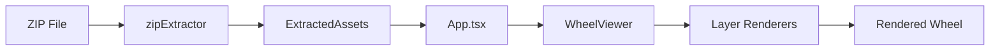

# Wheel Exporter Test

Interactive React application for rendering and testing spinning wheel components exported from a Figma plugin. Processes ZIP archives containing wheel configurations and assets to create fully functional, animated spinning wheels.

## 🚀 Quick Start

```bash
# Install dependencies
npm install

# Start development server
npm start

# Run tests
npm test

# Build for production
npm run build
```

## 📁 Project Structure

```
wheel-exporter-test/
├── src/
│   ├── components/
│   │   ├── WheelViewer.tsx        # Main wheel orchestrator
│   │   ├── ResultViewer.tsx       # Result display component
│   │   └── renderers/             # Layer-specific renderers
│   │       ├── BackgroundRenderer.tsx
│   │       ├── SegmentRenderer.tsx
│   │       ├── HeaderRenderer.tsx
│   │       ├── ButtonSpinRenderer.tsx
│   │       ├── WheelBgRenderer.tsx
│   │       ├── WheelTopRenderer.tsx
│   │       ├── PointerRenderer.tsx
│   │       ├── LightsRenderer.tsx
│   │       ├── CenterRenderer.tsx
│   │       └── GradientHandleRenderer.tsx
│   ├── utils/
│   │   ├── zipExtractor.ts        # ZIP file processing
│   │   └── segmentUtils.tsx       # Segment generation utilities
│   ├── types.ts                   # TypeScript definitions
│   └── App.tsx                    # Main application component
├── docs/                          # Documentation and assets
├── scripts/                       # Automation scripts (when needed)
└── screenshots/                   # Visual artifacts
```

## 🏗️ Architecture

### Core Components

#### **App.tsx** (`src/App.tsx`)
- Main application orchestrator
- Manages file upload and ZIP extraction
- Controls component visibility toggles
- Handles dimension settings (width/height)
- Segment count configuration (3-8)

#### **WheelViewer** (`src/components/WheelViewer.tsx`)
- Central wheel rendering component
- Manages animation state and rotation
- Handles component state transitions (header states, button states)
- Orchestrates all layer renderers
- Implements spin animation with overshoot and bounce-back

#### **Type System** (`src/types.ts`)
Key interfaces:
- `WheelExport`: Complete wheel configuration from positions.json
- `ExtractedAssets`: Processed ZIP contents with blob URLs
- `Fill/Gradient`: Complex gradient system (linear/radial/angular/diamond)
- `HeaderState`: 'active' | 'success' | 'fail'
- `ButtonSpinState`: 'default' | 'spinning'
- `WheelSegmentKind`: 'odd' | 'even' | 'nowin' | 'jackpot'

### Data Flow



1. **ZIP Upload**: User uploads Figma-exported ZIP
2. **Extraction**: `zipExtractor.ts` parses positions.json and images
3. **Asset Management**: Images converted to blob URLs
4. **Rendering**: WheelViewer orchestrates layer renderers
5. **Animation**: Spin animation with configurable segments

### Layer Rendering System

Layers render in strict Z-order (back to front):

| Layer | Component | Purpose |
|-------|-----------|---------|
| 1 | BackgroundRenderer | Static background image |
| 2 | WheelBgRenderer | Wheel background overlay |
| 3 | SegmentRenderer | Dynamic SVG segments with gradients |
| 4 | HeaderRenderer | State-based header (active/success/fail) |
| 5 | LightsRenderer | Decorative light effects |
| 6 | WheelTopRenderer (1) | First wheel overlay layer |
| 7 | WheelTopRenderer (2) | Second wheel overlay layer |
| 8 | PointerRenderer | Wheel pointer indicator |
| 9 | ButtonSpinRenderer | Interactive spin button |
| 10 | CenterRenderer | Debug center circle (optional) |
| 11 | GradientHandleRenderer | Debug gradient visualization |

### Coordinate Systems

#### Original Frame
- Absolute pixel coordinates from Figma export
- All positions in positions.json relative to frame size

#### Scaling
- Uniform scale to maintain aspect ratio
- `scale = min(targetWidth/frameWidth, targetHeight/frameHeight)`

#### Positioning Types
- **Center-based**: Wheel elements use (x, y) as center point
- **Bounding box**: Background/header use top-left (x, y) + dimensions

### Gradient System

#### Gradient Types
- **Linear**: Two-point gradient with direction
- **Radial**: Center point with radius
- **Angular**: Rotation-based gradient
- **Diamond**: Diamond-shaped gradient pattern

#### Handle System
- Handles contain normalized positions (0-1) within bounding box
- Linear: handle[1] = start (0%), handle[0] = end (100%)
- Radial: handle[0] = center, handle[1] = radius point
- Uses `objectBoundingBox` coordinate space for consistency

### Animation System

#### Spin Animation (`WheelViewer:handleSpin`)
```typescript
// Animation phases:
1. Calculate target segment (random)
2. Add 5-7 full rotations
3. Add overshoot (15-25°)
4. Main spin: 5s cubic-bezier easing
5. Bounce-back: 1.5s to final position
6. Total duration: 6.5s
```

## 🔧 Development Guidelines

### Required Directories

Per `CLAUDE.md` (CIB-001), maintain strict directory organization:

| Activity | Required Directory |
|----------|-------------------|
| Browser automation | `scripts/playwright/` |
| Analytics utilities | `scripts/tools/` |
| Screenshots/videos | `screenshots/` |
| Documentation | `docs/` |
| ❌ **Forbidden** | Project root (keep pristine) |

### Testing Protocol

1. **Always maintain 100% test coverage**
2. **Never run Vitest in watch mode for automation**
3. **Fix bugs in code, not tests**
4. **Use `npm test` for CI/CD**

### Task Management

For tasks with 3+ steps, use structured approach:
1. Sequential thinking for complex problems
2. TodoWrite for task tracking
3. Complete all tasks fully
4. Maintain test coverage

## 📦 ZIP File Format

Expected structure of Figma-exported ZIP:

```
wheel-export.zip
├── positions.json          # Main configuration
├── background.png         # Background image
├── header_*.png          # Header state images
├── wheel_bg.png          # Wheel background
├── wheel_top_*.png       # Wheel overlays
├── button_spin_*.png     # Button states
├── pointer.png           # Pointer image
├── segments/             # Segment assets
│   ├── odd.svg
│   ├── even.svg
│   ├── nowin.svg
│   └── jackpot.svg
└── rewards_prize_*.png   # Reward images (optional)
```

### positions.json Structure

```typescript
{
  wheelId: string,
  frameSize: { width: number, height: number },
  background: { exportUrl: string },
  header?: HeaderComponent,
  wheelBg?: WheelOverlay,
  segments?: WheelSegmentStyles,
  buttonSpin?: ButtonSpinComponent,
  center?: CenterComponent,
  pointer?: PointerComponent,
  lights?: LightsComponent,
  rewards?: RewardsComponent,
  exportedAt: string,
  metadata: { version: string, exportFormat?: string }
}
```

## 🎮 Features

### Core Functionality
- ✅ ZIP file upload and extraction
- ✅ Dynamic segment generation (3-8 segments)
- ✅ Smooth spin animation with physics
- ✅ Component visibility toggles
- ✅ Responsive scaling
- ✅ State management (header/button states)

### Gradient Support
- ✅ Linear gradients
- ✅ Radial gradients
- ✅ Angular gradients
- ✅ Diamond gradients
- ✅ Multi-stop color gradients
- ✅ Handle-based positioning

### Debug Features
- ✅ Center circle visualization
- ✅ Gradient handle visualization
- ✅ Component toggle controls
- ✅ Dimension controls

## 🛠️ Technologies

- **React** 19.1.1 - UI framework
- **TypeScript** 4.9.5 - Type safety
- **JSZip** 3.10.1 - ZIP file processing
- **React Scripts** 5.0.1 - Build tooling
- **Testing Library** - Component testing

## 📝 Key Patterns

### State Management
- Component visibility via `componentVisibility` object
- Animation state in WheelViewer
- Visual states local to components

### Segment Generation
- Dynamic creation based on `segmentCount`
- Alternating odd/even pattern
- SVG paths with gradient fills
- Styles from `WheelSegmentStyles`

### Image Handling
- Blob URLs via `URL.createObjectURL()`
- Passed as props to renderers
- Automatic cleanup on unmount

## 🚨 Important Notes

1. **Frame dimensions** define the original coordinate space
2. **Gradients** use handles when available, fallback to rotation
3. **Center component** defines exclusion zone (optional)
4. **All renderers** are independent React components
5. **Scaling** maintains aspect ratio automatically
6. **Animation** includes overshoot for realistic physics

## 📐 Coordinate Transformations

```typescript
// Original to scaled coordinates
scaledX = originalX * scale
scaledY = originalY * scale

// Center-based to absolute
absoluteX = centerX - (width / 2)
absoluteY = centerY - (height / 2)

// Gradient handle normalization
normalizedX = handleX // Already 0-1
normalizedY = handleY // Already 0-1
```

## 🎯 Usage Tips

1. **Upload ZIP**: Use files exported from Figma Wheel Plugin
2. **Adjust Settings**: Configure dimensions and segment count
3. **Toggle Components**: Show/hide individual layers
4. **Test Animation**: Click spin button to test
5. **Debug**: Enable gradient handles for visualization

## 🔄 Animation Timing

| Phase | Duration | Description |
|-------|----------|-------------|
| Spin | 5000ms | Main rotation with overshoot |
| Bounce | 1500ms | Settle to final position |
| Total | 6500ms | Complete animation cycle |

## 🐛 Debugging

Enable debug features:
- Toggle center circle for exclusion zone
- Show gradient handles for positioning
- Use component toggles to isolate layers
- Check console for extraction logs

## 📚 For LLM Agents

When working on this project:

1. **Follow CLAUDE.md instructions** (CIB-001)
2. **Use proper directories** for scripts/screenshots
3. **Maintain test coverage** at 100%
4. **Complete all tasks fully** without simplification
5. **Use sequential thinking** for complex problems
6. **Track tasks** with TodoWrite for 3+ steps

Key files to understand:
- `src/types.ts` - All TypeScript interfaces
- `src/components/WheelViewer.tsx` - Main orchestrator
- `src/utils/zipExtractor.ts` - ZIP processing logic
- `src/utils/segmentUtils.tsx` - Segment generation
- `CLAUDE.md` - Critical instructions (override defaults)